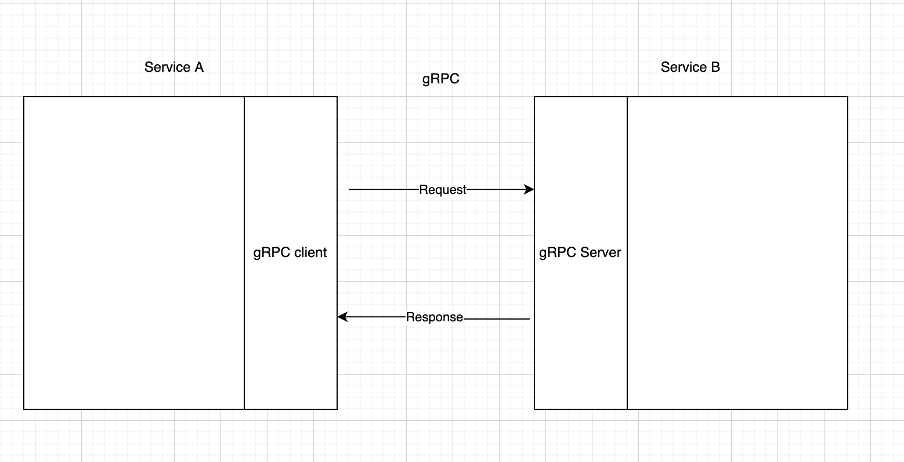

# Integrating with gRPC (a 2 minutes overview)

---

# Agenda

1. RPC
2. gRPC
   - gRPC artifacts
   - client

---

# RPC

- Remote procedure call (RPC) is when a computer program causes a procedure to execute in a different address space (commonly on another computer on a shared network), which is coded as if it were a normal (local) procedure call, without the programmer explicitly coding the details for the remote interaction

----

# gRPC

- gRPC is a modern open source high performance Remote Procedure Call (RPC) framework that can run in any environment. It can efficiently connect services in and across data centers with pluggable support for load balancing, tracing, health checking and authentication. It is also applicable in last mile of distributed computing to connect devices, mobile applications and browsers to backend services.

---

# gRPC artifacts

Developers using gRPC start with a language agnostic description of an RPC service (a collection of methods). From this description, gRPC will generate client and server side interfaces in any of the supported languages. The server implements the service interface, which can be remotely invoked by the client interface.

By default, gRPC uses Protocol Buffers as the Interface Definition Language (IDL) for describing both the service interface and the structure of the payload messages. It is possible to use other alternatives if desired.

----

# gRPC artifacts

- Protocol Buffers (a.k.a., protobuf) are Google's language-neutral, platform-neutral, extensible mechanism for serializing structured data.

- https://developers.google.com/protocol-buffers/docs/style
- https://developers.google.com/protocol-buffers/docs/javatutorial

---

# Overview

---

# gRPC artifacts

- Client
- Server
- Request
- Response

---

# Client

- gRPC most important configs:
  - Retry policy (including [backoff](https://github.com/grpc/grpc/blob/master/doc/connection-backoff.md)):([java](https://github.com/grpc/grpc-java/blob/master/core/src/main/java/io/grpc/internal/RetryPolicy.java))

---

# Source

- https://github.com/grpc/grpc/blob/master/CONCEPTS.md
- https://github.com/protocolbuffers/protobuf